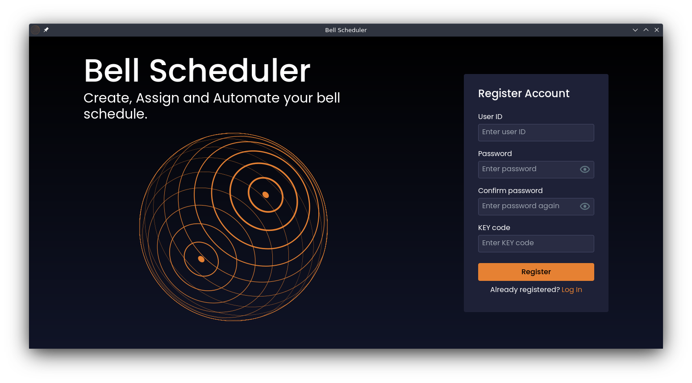

# Automatic Bell - Desktop App

## Overview
An automatic bell control system that allows users to manage bell schedules through a desktop application. The desktop app, built with React, Tauri, and TypeScript, serves as the user interface for configuring and managing the control unit.

## Features
- User authentication (Signup, Sign-in, Forgot Password)
- Dashboard to view and manage schedules
- Create, edit, and assign schedules
- Manual bell ringing
- Settings for Wi-Fi, time offset, and connection attempts
- Automatic updates

## Technologies Used
- **Frontend:** React, TypeScript
- **Backend:** Tauri
- **Styling:** TailwindCSS
- **Package Manager:** npm

## Installation
### Prerequisites
- Node.js (v16+)
- npm (v8+)
- Rust (for Tauri)

### Setup
1. Clone the repository:
   ```sh
   git clone https://github.com/dev-spectre/automatic-bell-frontend.git
   cd automatic-bell-frontend
   ```
2. Install dependencies:
   ```sh
   npm install
   ```
3. Run the application in development mode:
   ```sh
   npm run tauri dev
   ```

## Building the Application
To build the desktop app for different platforms:
```sh
npm run tauri build
```

## Download Releases
The latest releases can be downloaded from [GitHub Releases](https://github.com/dev-spectre/automatic-bell-frontend/releases).

| OS      | File Format |
|---------|------------|
| Windows | `.msi`, `.exe` |
| Linux   | `.AppImage`, `.deb`, `.rpm` |
| macOS   | `.dmg` |

## Usage Instructions
### Connecting to Control Unit
- Ensure that the desktop app and the control unit are connected to the same Wi-Fi network.
- The control unit will register its IP address on an external server, which will be accessed by the desktop app.

### Managing Schedules
1. **Create Schedule**: Define a schedule with start time, end time, chime mode, and intervals.
2. **Assign Schedule**: Assign schedules as weekly, once, or monthly.
3. **Edit/Delete Schedule**: Modify or remove existing schedules.

### Manual Ringing
Use the manual mode to ring the bell instantly without altering schedules.

### Settings
- Configure Wi-Fi credentials.
- Set time offsets for accurate synchronization.
- Adjust the minimum gap between rings.

## Troubleshooting
### Connection Issues
- Ensure the desktop app is on the same network as the control unit.
- Restart the control unit if it fails to connect.

### Forgotten Password
- Use the "Forgot Password" option and enter the key code (device MAC address in lowercase) to reset the password.

## Contributing
1. Fork the repository.
2. Create a feature branch (`git checkout -b feature-branch`).
3. Commit changes (`git commit -m 'Add feature'`).
4. Push to the branch (`git push origin feature-branch`).
5. Open a pull request.

## Screenshots




